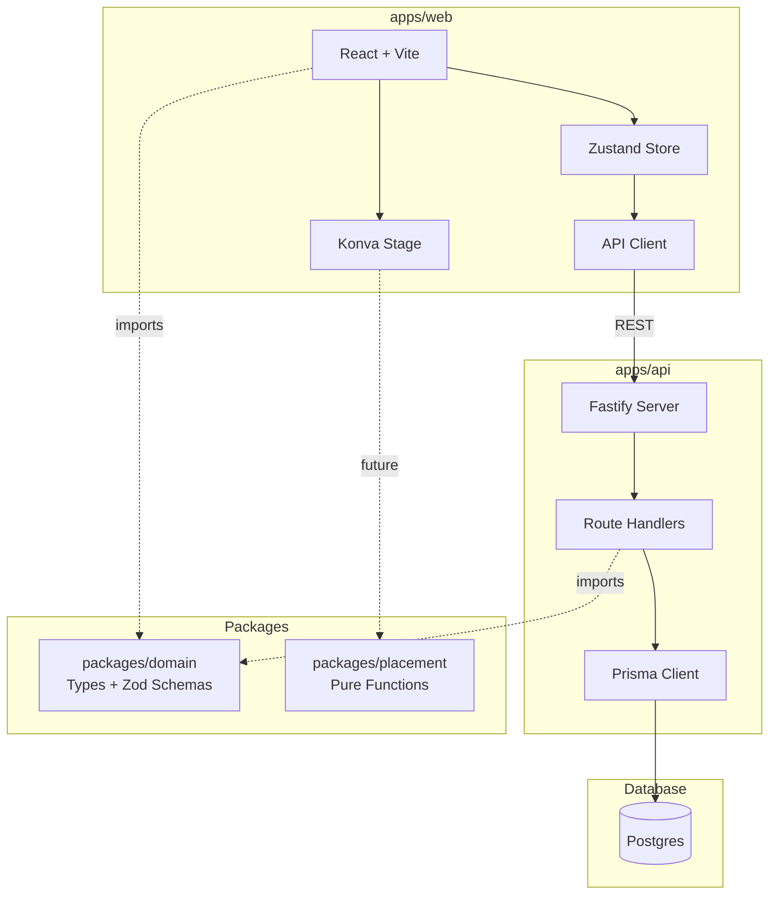

# SPEC.md — Sprint 0 + Sprint 1

> Canonical artifact for Sprints 0–1. Coder must follow this exactly.

---

## Goals

### Sprint 0 — Foundations
- Scaffold pnpm monorepo with `/apps/web`, `/apps/api`, `/packages/domain`, `/packages/placement`
- Configure TypeScript, ESLint, Prettier across all packages
- Set up CI (GitHub Actions) running lint + unit tests
- Create Postgres DB schema for static geometry (PlotBase, BedBase)
- Seed minimal crop catalog (2–3 crops)
- API endpoints: `POST /plots`, `GET /plots/:id`, `POST /plots/:id/beds`, `PUT /beds/:id`

### Sprint 1 — Plot + Bed Editor (Static Geometry)
- Blank canvas renders on app load
- Draw rectangular plot boundary with live dimension labels
- Add bed rectangles (set width/length, drag to position)
- Rotate beds with handle + angle snapping (0°/15°/30°/45°/90°)
- Resize beds by dragging corners/edges
- Lock geometry toggle (prevents move/resize/rotate when locked)
- Persist plot + beds to backend; reload shows same state

---

## Non-goals (do NOT implement)

- Seasons, sections, plantings (Sprint 2+)
- Plant placement / spacing visualization (Sprint 4)
- Event logging (Sprint 3)
- Polygon plot boundaries (backlog)
- User authentication (backlog)
- Mobile/responsive design (backlog)

---

## Constraints & Invariants

1. **Coordinate system:** World coordinates in meters. All dimensions stored/displayed in meters.
2. **Bed local coords:** Origin at top-left corner; X = length direction, Y = width direction.
3. **No feature creep:** Any idea not in this spec → add to `docs/BACKLOG.md`, do not implement.
4. **Pure packages:** `/packages/domain` and `/packages/placement` must have zero React/UI dependencies.
5. **Testing:** Unit tests required for coordinate transforms; Vitest preferred.
6. **DB:** Postgres with Prisma ORM (Node/Fastify backend chosen per spec recommendation).

---

## Architecture



### Tech Stack (locked)

| Layer | Choice | Version (target) |
|-------|--------|------------------|
| Frontend | React + TypeScript + Vite | React 18, Vite 5 |
| Canvas | Konva + react-konva | Konva 9, react-konva 18 |
| State | Zustand | 4.x |
| Forms | React Hook Form + Zod | RHF 7, Zod 3 |
| Backend | Node + Fastify | Node 20 LTS, Fastify 4 |
| ORM | Prisma | 5.x |
| Database | Postgres | 15+ |
| Monorepo | pnpm workspaces | pnpm 8+ |
| Testing | Vitest | 1.x |
| Linting | ESLint + Prettier | Latest |
| CI | GitHub Actions | — |

> **Context7 note:** Context7 MCP tools not available in this environment. Above versions are assumptions based on current stable releases. Coder should verify compatibility.

---

## Data Flow & Interfaces

### Data Models (Sprint 0–1 scope)

```typescript
// packages/domain/src/models/plot.ts
interface PlotBase {
  id: string;           // UUID
  name: string;
  units: 'meters' | 'feet';  // MVP: meters only
  boundaryType: 'rect';      // MVP: rect only (poly later)
  boundary: {
    width: number;      // meters
    height: number;     // meters
  };
  createdAt: Date;
  updatedAt: Date;
}

// packages/domain/src/models/bed.ts
interface BedBase {
  id: string;           // UUID
  plotId: string;       // FK to PlotBase
  name: string;
  x: number;            // world coords (meters)
  y: number;
  width: number;        // meters
  height: number;       // meters (length)
  rotationDeg: number;  // 0-360
  isLocked: boolean;    // geometry lock
  createdAt: Date;
  updatedAt: Date;
}
```

### Zod Schemas

```typescript
// packages/domain/src/schemas/plot.ts
import { z } from 'zod';

export const CreatePlotSchema = z.object({
  name: z.string().min(1).max(100),
  units: z.enum(['meters']),  // feet later
  boundary: z.object({
    width: z.number().positive().max(1000),
    height: z.number().positive().max(1000),
  }),
});

export const UpdatePlotSchema = CreatePlotSchema.partial();

// packages/domain/src/schemas/bed.ts
export const CreateBedSchema = z.object({
  name: z.string().min(1).max(100),
  x: z.number().min(0),
  y: z.number().min(0),
  width: z.number().positive().max(100),
  height: z.number().positive().max(100),
  rotationDeg: z.number().min(0).max(360).default(0),
});

export const UpdateBedSchema = CreateBedSchema.partial().extend({
  isLocked: z.boolean().optional(),
});
```

### API Endpoints (Sprint 0–1)

| Method | Path | Body | Response | Notes |
|--------|------|------|----------|-------|
| POST | `/plots` | CreatePlotSchema | PlotBase | Create new plot |
| GET | `/plots/:id` | — | PlotBase + beds[] | Fetch plot with all beds |
| PUT | `/plots/:id` | UpdatePlotSchema | PlotBase | Update plot boundary |
| POST | `/plots/:id/beds` | CreateBedSchema | BedBase | Add bed to plot |
| PUT | `/beds/:id` | UpdateBedSchema | BedBase | Update bed geometry/lock |
| DELETE | `/beds/:id` | — | 204 | Remove bed |

### Prisma Schema (Sprint 0–1)

```prisma
// apps/api/prisma/schema.prisma
generator client {
  provider = "prisma-client-js"
}

datasource db {
  provider = "postgresql"
  url      = env("DATABASE_URL")
}

model PlotBase {
  id           String   @id @default(uuid())
  name         String
  units        String   @default("meters")
  boundaryType String   @default("rect")
  boundaryJson Json     // { width, height }
  createdAt    DateTime @default(now())
  updatedAt    DateTime @updatedAt
  beds         BedBase[]
}

model BedBase {
  id          String   @id @default(uuid())
  plotId      String
  plot        PlotBase @relation(fields: [plotId], references: [id], onDelete: Cascade)
  name        String
  x           Float
  y           Float
  width       Float
  height      Float
  rotationDeg Float    @default(0)
  isLocked    Boolean  @default(false)
  createdAt   DateTime @default(now())
  updatedAt   DateTime @updatedAt

  @@index([plotId])
}

// Seed data models (for crop catalog)
model Crop {
  id        String    @id @default(uuid())
  name      String    @unique
  family    String?
  varieties Variety[]
}

model Variety {
  id              String  @id @default(uuid())
  cropId          String
  crop            Crop    @relation(fields: [cropId], references: [id], onDelete: Cascade)
  name            String
  rowSpacingCm    Float?
  plantSpacingCm  Float?
  matureSpreadCm  Float?
  growthHabit     String? // upright | bush | vine

  @@index([cropId])
}
```

---

## Phases & Sprint Plan

### Sprint 0 — Foundations

| Ticket | Description | Acceptance |
|--------|-------------|------------|
| S0-1 | Scaffold monorepo | `pnpm install` works; all 4 packages exist |
| S0-2 | Configure TypeScript | `tsconfig.base.json` + per-package extends |
| S0-3 | Configure ESLint + Prettier | `pnpm lint` runs across all packages |
| S0-4 | Set up `/apps/api` with Fastify | Server starts on `localhost:3001` |
| S0-5 | Set up Prisma + Postgres | `pnpm db:migrate` creates tables |
| S0-6 | Implement plot CRUD endpoints | POST/GET/PUT `/plots` work |
| S0-7 | Implement bed CRUD endpoints | POST/PUT/DELETE `/beds` work |
| S0-8 | Seed crop catalog | 2–3 crops with varieties in DB |
| S0-9 | Set up `/apps/web` with Vite + React | Dev server runs on `localhost:5173` |
| S0-10 | Configure CI (GitHub Actions) | Lint + tests run on push/PR |

**Sprint 0 Acceptance:** `pnpm test` passes; API can create/fetch a plot with beds.

---

### Sprint 1 — Plot + Bed Editor

| Ticket | Description | Acceptance |
|--------|-------------|------------|
| S1-1 | Blank Konva canvas | Stage renders, pan/zoom with mouse |
| S1-2 | Draw plot boundary tool | Click-drag creates rect; shows dimensions live |
| S1-3 | Plot dimension labels | Width/height/area displayed on canvas |
| S1-4 | Add bed tool | Button opens modal; bed appears on canvas |
| S1-5 | Drag bed to position | Beds draggable within plot bounds |
| S1-6 | Resize bed (handles) | Corner/edge handles resize; min size enforced |
| S1-7 | Rotate bed (handle) | Rotation handle; snaps to 0/15/30/45/90° |
| S1-8 | Bed dimension labels | Width/height shown on each bed |
| S1-9 | Lock geometry toggle | UI toggle; locked beds ignore drag/resize/rotate |
| S1-10 | Zustand store for canvas state | Plots + beds in store; syncs with API |
| S1-11 | Persist on change | Debounced save to API on geometry change |
| S1-12 | Load state on mount | Fetch plot + beds from API on app load |

**Sprint 1 Acceptance:**
- User can create plot + beds, reload page, see same geometry
- Locked beds cannot be moved/resized/rotated
- Dimension labels update live during drag/resize

---

## Risks & Open Questions

| Risk | Mitigation |
|------|------------|
| Konva performance with many beds | Defer; spec says 20 beds is fine for MVP |
| Coordinate precision (float errors) | Use `toFixed(4)` for display; full precision in storage |
| Offline-first needed? | No; defer to PWA backlog item |

| Open Question | Decision |
|---------------|----------|
| Units: support feet? | MVP = meters only; feet conversion is backlog |
| Undo/redo? | Not in Sprint 0–1; add to backlog if needed |
| Multi-plot? | Not MVP; single plot per session |

---

## File Structure (target after Sprint 1)

```
allotment/
├── apps/
│   ├── web/
│   │   ├── src/
│   │   │   ├── main.tsx
│   │   │   ├── App.tsx
│   │   │   ├── components/
│   │   │   │   ├── Canvas/
│   │   │   │   │   ├── PlotCanvas.tsx      # Main Konva Stage
│   │   │   │   │   ├── PlotBoundary.tsx    # Plot rect shape
│   │   │   │   │   ├── BedShape.tsx        # Bed rect with handles
│   │   │   │   │   ├── DimensionLabel.tsx  # Text labels
│   │   │   │   │   └── TransformHandle.tsx # Rotate/resize handles
│   │   │   │   ├── Toolbar/
│   │   │   │   │   ├── Toolbar.tsx
│   │   │   │   │   └── LockToggle.tsx
│   │   │   │   └── Modals/
│   │   │   │       ├── CreatePlotModal.tsx
│   │   │   │       └── AddBedModal.tsx
│   │   │   ├── store/
│   │   │   │   ├── index.ts
│   │   │   │   ├── plotStore.ts
│   │   │   │   └── uiStore.ts
│   │   │   ├── api/
│   │   │   │   └── client.ts               # Fetch wrapper
│   │   │   └── utils/
│   │   │       └── geometry.ts             # Snap angles, bounds check
│   │   ├── index.html
│   │   ├── package.json
│   │   ├── tsconfig.json
│   │   └── vite.config.ts
│   │
│   └── api/
│       ├── src/
│       │   ├── index.ts                    # Fastify entry
│       │   ├── routes/
│       │   │   ├── plots.ts
│       │   │   └── beds.ts
│       │   └── services/
│       │       ├── plotService.ts
│       │       └── bedService.ts
│       ├── prisma/
│       │   ├── schema.prisma
│       │   ├── migrations/
│       │   └── seed.ts
│       ├── package.json
│       └── tsconfig.json
│
├── packages/
│   ├── domain/
│   │   ├── src/
│   │   │   ├── index.ts
│   │   │   ├── models/
│   │   │   │   ├── plot.ts
│   │   │   │   └── bed.ts
│   │   │   └── schemas/
│   │   │       ├── plot.ts
│   │   │       └── bed.ts
│   │   ├── package.json
│   │   └── tsconfig.json
│   │
│   └── placement/
│       ├── src/
│       │   ├── index.ts
│       │   └── transforms.ts               # Bed-local ↔ world
│       ├── __tests__/
│       │   └── transforms.test.ts
│       ├── package.json
│       └── tsconfig.json
│
├── package.json
├── pnpm-workspace.yaml
├── tsconfig.base.json
├── .eslintrc.js
├── .prettierrc
└── .github/
    └── workflows/
        └── ci.yml
```

---

## References

- Main spec: [docs/spec.md](spec.md)
- Backlog: [docs/BACKLOG.md](BACKLOG.md)
- Test plan: [docs/TEST_PLAN.md](TEST_PLAN.md)
