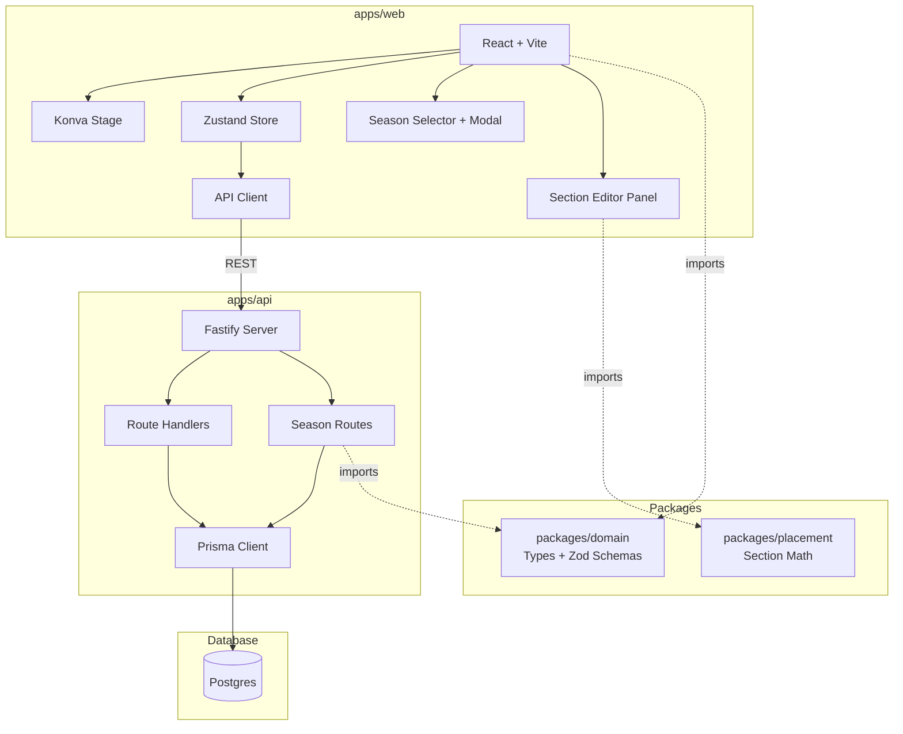

# SPEC.md — Sprint 2: Seasons + Sections

> Canonical artifact for Sprint 2. Coder must follow this exactly.

---

## Goals

### Sprint 2 — Seasons + Sections
- Create Season entity referencing static plot/beds (geometry remains untouched)
- Implement BedSectionPlan to define how beds are subdivided per season
- Support lengthwise splits (MVP mode) for sectioning beds
- Render section overlays on canvas within beds
- CRUD operations for seasons and section plans
- Section data persists and renders correctly after page refresh

---

## Non-goals (do NOT implement)

- Plantings assignment to sections (Sprint 3)
- Plant placement / spacing visualization (Sprint 4)
- Event logging (Sprint 3)
- Grid sectioning mode (backlog item #4)
- Clone season functionality (backlog item #1)
- Crop catalog CRUD UI (Sprint 3)
- Timeline/calendar views (backlog)

---

## Constraints & Invariants

1. **Static geometry is immutable during season operations:** Seasons reference existing PlotBase and BedBase. Creating/editing a season MUST NOT modify bed position, size, or rotation.
2. **Coordinate system:** Sections are stored in **bed-local coordinates** (origin at bed top-left, X = length direction, Y = width direction). This makes sections stable regardless of bed world position/rotation.
3. **Section bounds:** For lengthwise splits, sections span full bed width (0 to bed.width) and are divided along bed length (height in local coords).
4. **No feature creep:** Any idea not in this spec → add to `docs/BACKLOG.md`, do not implement.
5. **Pure packages:** Section coordinate calculations should live in `/packages/placement` or `/packages/domain` with unit tests.
6. **DB consistency:** All seasonal data cascades on season delete. BedSectionPlan cascades on bed delete.

---

## Architecture



---

## Data Flow & Interfaces

### New Data Models (Sprint 2)

```typescript
// packages/domain/src/models/season.ts
interface Season {
  id: string;           // UUID
  plotId: string;       // FK to PlotBase
  label: string;        // e.g., "2026 Spring/Summer"
  startDate: string;    // ISO date string
  endDate: string;      // ISO date string
  createdAt: Date;
  updatedAt: Date;
}

// packages/domain/src/models/section.ts
interface BedSectionPlan {
  id: string;           // UUID
  seasonId: string;     // FK to Season
  bedId: string;        // FK to BedBase
  mode: 'length_splits'; // MVP: only length_splits (grid later)
  definition: LengthSplitDefinition;
  createdAt: Date;
  updatedAt: Date;
}

interface LengthSplitDefinition {
  // Array of cut positions along bed length (in meters from bed origin)
  // Example: [1.0, 2.0] creates 3 sections: 0-1m, 1-2m, 2m-bedLength
  cuts: number[];
}

// Derived at runtime (not persisted separately for MVP)
interface Section {
  id: string;           // Generated: `${bedSectionPlanId}-${index}`
  bedSectionPlanId: string;
  bedId: string;
  index: number;        // 0, 1, 2, ...
  name: string;         // "Section A", "Section B", etc.
  boundsLocal: {        // Bed-local coordinates
    x0: number;         // Start along length (always 0 for lengthwise)
    x1: number;         // End along length (always bed.width)
    y0: number;         // Start along width (cut position or 0)
    y1: number;         // End along width (next cut or bed.height)
  };
}
```

### Zod Schemas

```typescript
// packages/domain/src/schemas/season.ts
import { z } from 'zod';

export const CreateSeasonSchema = z.object({
  label: z.string().min(1).max(100),
  startDate: z.string().regex(/^\d{4}-\d{2}-\d{2}$/), // YYYY-MM-DD
  endDate: z.string().regex(/^\d{4}-\d{2}-\d{2}$/),
}).refine(data => data.startDate <= data.endDate, {
  message: "End date must be after start date",
});

export const UpdateSeasonSchema = CreateSeasonSchema.partial();

// packages/domain/src/schemas/section.ts
export const LengthSplitDefinitionSchema = z.object({
  cuts: z.array(z.number().positive()).refine(
    cuts => cuts.every((cut, i) => i === 0 || cut > cuts[i - 1]),
    { message: "Cuts must be monotonically increasing" }
  ),
});

export const CreateBedSectionPlanSchema = z.object({
  bedId: z.string().uuid(),
  mode: z.literal('length_splits'),
  definition: LengthSplitDefinitionSchema,
});

export const UpdateBedSectionPlanSchema = z.object({
  mode: z.literal('length_splits').optional(),
  definition: LengthSplitDefinitionSchema.optional(),
});
```

### API Endpoints (Sprint 2)

| Method | Path | Body | Response | Notes |
|--------|------|------|----------|-------|
| POST | `/plots/:plotId/seasons` | CreateSeasonSchema | Season | Create season for plot |
| GET | `/plots/:plotId/seasons` | — | Season[] | List all seasons for plot |
| GET | `/seasons/:id` | — | Season + bedSectionPlans[] | Get season with all section plans |
| PUT | `/seasons/:id` | UpdateSeasonSchema | Season | Update season dates/label |
| DELETE | `/seasons/:id` | — | 204 | Delete season (cascades plans) |
| POST | `/seasons/:seasonId/bed-plans` | CreateBedSectionPlanSchema | BedSectionPlan | Create section plan for bed |
| GET | `/seasons/:seasonId/bed-plans` | — | BedSectionPlan[] | List all section plans |
| PUT | `/bed-plans/:id` | UpdateBedSectionPlanSchema | BedSectionPlan | Update section cuts |
| DELETE | `/bed-plans/:id` | — | 204 | Remove section plan |

### Prisma Schema Additions

```prisma
// Add to apps/api/prisma/schema.prisma

model Season {
  id              String           @id @default(uuid())
  plotId          String
  plot            PlotBase         @relation(fields: [plotId], references: [id], onDelete: Cascade)
  label           String
  startDate       DateTime
  endDate         DateTime
  createdAt       DateTime         @default(now())
  updatedAt       DateTime         @updatedAt
  bedSectionPlans BedSectionPlan[]

  @@index([plotId])
}

model BedSectionPlan {
  id             String   @id @default(uuid())
  seasonId       String
  season         Season   @relation(fields: [seasonId], references: [id], onDelete: Cascade)
  bedId          String
  bed            BedBase  @relation(fields: [bedId], references: [id], onDelete: Cascade)
  mode           String   @default("length_splits")
  definitionJson Json     // { cuts: number[] }
  createdAt      DateTime @default(now())
  updatedAt      DateTime @updatedAt

  @@unique([seasonId, bedId]) // One plan per bed per season
  @@index([seasonId])
  @@index([bedId])
}

// Update existing models to add relations:
// PlotBase: add seasons Season[]
// BedBase: add sectionPlans BedSectionPlan[]
```

---

## Section Calculation Logic

Add to `/packages/placement/src/sections.ts`:

```typescript
/**
 * Calculate section bounds from a length_splits definition.
 * Sections span full bed width and are divided along bed length.
 *
 * @param bedWidth - Bed width in meters (local Y dimension)
 * @param bedHeight - Bed height/length in meters (local X dimension)
 * @param cuts - Array of cut positions along length (meters from origin)
 * @returns Array of section bounds in bed-local coordinates
 */
export function calculateLengthSplitSections(
  bedWidth: number,
  bedHeight: number,
  cuts: number[]
): SectionBounds[] {
  const validCuts = cuts.filter(c => c > 0 && c < bedHeight).sort((a, b) => a - b);
  const boundaries = [0, ...validCuts, bedHeight];

  return boundaries.slice(0, -1).map((start, index) => ({
    index,
    name: `Section ${String.fromCharCode(65 + index)}`, // A, B, C, ...
    boundsLocal: {
      x0: 0,
      x1: bedWidth,
      y0: start,
      y1: boundaries[index + 1],
    },
  }));
}
```

**Unit tests required:**
- Empty cuts array → single section covering entire bed
- Single cut → two sections
- Multiple cuts → correct number of sections with correct bounds
- Cuts outside bed bounds are filtered
- Cuts are sorted before processing

---

## Phases & Sprint Plan

### Sprint 2 Tickets

| Ticket | Description | Acceptance Criteria |
|--------|-------------|---------------------|
| S2-1 | Add Season + BedSectionPlan models to Prisma | `pnpm db:migrate` succeeds; models exist in DB |
| S2-2 | Update PlotBase/BedBase relations | Relations defined; cascade deletes work |
| S2-3 | Implement season CRUD API routes | POST/GET/PUT/DELETE `/seasons` endpoints work |
| S2-4 | Implement bed-plan CRUD API routes | POST/GET/PUT/DELETE `/bed-plans` endpoints work |
| S2-5 | Add Season + BedSectionPlan types to domain package | Types + Zod schemas exported from @allotment/domain |
| S2-6 | Implement section calculation in placement package | `calculateLengthSplitSections` function with tests |
| S2-7 | Create SeasonSelector component | Dropdown to select/switch seasons |
| S2-8 | Create CreateSeasonModal component | Modal form to create new season |
| S2-9 | Add seasonStore to Zustand | Store for current season + section plans |
| S2-10 | Render section overlays on BedShape | Sections visible as colored subdivisions |
| S2-11 | Create SectionEditor panel | UI to add/remove/adjust section cuts |
| S2-12 | Integrate section editing with canvas | Click section to select; visual feedback |
| S2-13 | Persist section changes | Debounced save of section plan updates |
| S2-14 | Load season state on mount | Fetch season + plans when season selected |

### Ticket Details

#### S2-1: Add Season + BedSectionPlan models to Prisma
- Add models as specified in Prisma Schema Additions section
- Create migration: `pnpm --filter api db:migrate`
- Verify tables created in PostgreSQL

#### S2-2: Update PlotBase/BedBase relations
- Add `seasons Season[]` to PlotBase model
- Add `sectionPlans BedSectionPlan[]` to BedBase model
- Test cascade delete: deleting a bed removes its section plans

#### S2-3: Implement season CRUD API routes
- Create `apps/api/src/routes/seasons.ts`
- Create `apps/api/src/services/seasonService.ts`
- Register routes in main server file
- Validate input with Zod schemas

#### S2-4: Implement bed-plan CRUD API routes
- Create `apps/api/src/routes/bedPlans.ts`
- Create `apps/api/src/services/bedPlanService.ts`
- Enforce unique constraint (one plan per bed per season)
- Return 409 Conflict if plan already exists for bed in season

#### S2-5: Add Season + BedSectionPlan types to domain package
- Create `packages/domain/src/models/season.ts`
- Create `packages/domain/src/models/section.ts`
- Create `packages/domain/src/schemas/season.ts`
- Create `packages/domain/src/schemas/section.ts`
- Export from `packages/domain/src/index.ts`

#### S2-6: Implement section calculation in placement package
- Create `packages/placement/src/sections.ts`
- Implement `calculateLengthSplitSections` function
- Create `packages/placement/__tests__/sections.test.ts`
- Minimum 5 test cases as specified above

#### S2-7: Create SeasonSelector component
- Create `apps/web/src/components/Seasons/SeasonSelector.tsx`
- Dropdown showing all seasons for current plot
- "New Season" option opens modal
- Selecting season updates store and loads section plans

#### S2-8: Create CreateSeasonModal component
- Create `apps/web/src/components/Modals/CreateSeasonModal.tsx`
- Form fields: label, startDate (date picker), endDate (date picker)
- Validation: end date must be after start date
- Submit creates season via API

#### S2-9: Add seasonStore to Zustand
- Create `apps/web/src/store/seasonStore.ts`
- State: `currentSeason`, `seasons[]`, `bedSectionPlans[]`, `isLoading`
- Actions: `setCurrentSeason`, `setSeasons`, `setBedSectionPlans`, `updateBedSectionPlan`

#### S2-10: Render section overlays on BedShape
- Modify `BedShape.tsx` to accept section data
- Render colored rectangles for each section within bed bounds
- Use distinct colors (alternating pastels) for adjacent sections
- Section labels ("A", "B", "C") displayed in center

#### S2-11: Create SectionEditor panel
- Create `apps/web/src/components/Sections/SectionEditor.tsx`
- Panel appears when bed selected AND season active
- Shows current cuts as editable list
- "Add Split" button adds cut at midpoint of largest section
- "Remove" button next to each cut
- Visual preview of section layout

#### S2-12: Integrate section editing with canvas
- Click on section highlights it (different from bed selection)
- Selected section shows in SectionEditor
- Double-click on section boundary allows drag to adjust (stretch goal)

#### S2-13: Persist section changes
- Use debounced save (500ms) similar to bed persistence
- Create `apps/web/src/hooks/usePersistBedPlan.ts`
- Optimistic updates in store

#### S2-14: Load season state on mount
- On season selection, fetch GET `/seasons/:id`
- Populate bedSectionPlans in store
- If no season selected, section overlays hidden

---

## UI/UX Requirements

### Season Selector
- Location: Top toolbar area, left of existing tools
- Default state: "No Season" or first season if exists
- Shows season label + date range

### Section Visualization
- Sections render as semi-transparent colored overlays within bed
- Colors: Alternating pastel scheme (e.g., light green, light blue, light yellow)
- Opacity: 0.3-0.4 to see bed underneath
- Border: 1px dashed line between sections
- Label: Section letter (A, B, C) centered in section

### Section Editor Panel
- Location: Right sidebar (collapsible)
- Shows only when: bed selected AND season active
- Contents:
  - Bed name header
  - List of sections with dimensions
  - Cut position inputs (editable numbers)
  - Add/Remove cut buttons

---

## Risks & Open Questions

| Risk | Mitigation |
|------|------------|
| Section rendering performance with many sections | Limit to max 10 sections per bed for MVP |
| Complex rotation math for section overlays | Sections render in bed-local space; rotation handled by Konva Group |
| User confusion between bed selection and section selection | Use distinct visual indicators (bed = blue border, section = highlight fill) |

| Open Question | Decision |
|---------------|----------|
| Max sections per bed? | 10 for MVP (enforced in UI, not API) |
| Section naming scheme? | Alphabetical (A-J) for MVP |
| Allow section resize by dragging? | Stretch goal; MVP uses numeric input only |

---

## File Structure (additions for Sprint 2)

```
allotment/
├── apps/
│   ├── web/
│   │   └── src/
│   │       ├── components/
│   │       │   ├── Seasons/
│   │       │   │   └── SeasonSelector.tsx    # NEW
│   │       │   ├── Sections/
│   │       │   │   └── SectionEditor.tsx     # NEW
│   │       │   └── Modals/
│   │       │       └── CreateSeasonModal.tsx # NEW
│   │       ├── store/
│   │       │   └── seasonStore.ts            # NEW
│   │       ├── hooks/
│   │       │   └── usePersistBedPlan.ts      # NEW
│   │       └── api/
│   │           └── client.ts                 # UPDATE: add season/plan endpoints
│   │
│   └── api/
│       ├── src/
│       │   ├── routes/
│       │   │   ├── seasons.ts                # NEW
│       │   │   └── bedPlans.ts               # NEW
│       │   └── services/
│       │       ├── seasonService.ts          # NEW
│       │       └── bedPlanService.ts         # NEW
│       └── prisma/
│           ├── schema.prisma                 # UPDATE: add Season, BedSectionPlan
│           └── migrations/
│               └── YYYYMMDD_add_seasons/     # NEW migration
│
├── packages/
│   ├── domain/
│   │   └── src/
│   │       ├── models/
│   │       │   ├── season.ts                 # NEW
│   │       │   └── section.ts                # NEW
│   │       ├── schemas/
│   │       │   ├── season.ts                 # NEW
│   │       │   └── section.ts                # NEW
│   │       └── index.ts                      # UPDATE: export new types
│   │
│   └── placement/
│       ├── src/
│       │   ├── sections.ts                   # NEW
│       │   └── index.ts                      # UPDATE: export sections
│       └── __tests__/
│           └── sections.test.ts              # NEW
```

---

## Sprint 2 Acceptance Criteria

**Definition of Done:**

1. ✅ User can create a new season with label and date range
2. ✅ User can select between multiple seasons
3. ✅ User can create section plans for beds within a season
4. ✅ Sections render as colored overlays on the canvas
5. ✅ User can add/remove section cuts via the editor panel
6. ✅ Section plans persist to database
7. ✅ Page refresh maintains season and section state
8. ✅ Deleting a season removes all its section plans
9. ✅ Deleting a bed removes its section plans across all seasons
10. ✅ Unit tests pass for section calculation logic
11. ✅ No modifications to bed geometry when editing sections

---

## References

- Main spec: [docs/spec.md](spec.md) - Section 14 (Sprints/Phases)
- Sprint 0-1 spec: [docs/SPRINT_0_1_SPEC.md](SPRINT_0_1_SPEC.md)
- Backlog: [docs/BACKLOG.md](BACKLOG.md)
- Test plan: [docs/TEST_PLAN.md](TEST_PLAN.md)

---

# HANDOFF

## To Coder (implementation-ready bullets)

### Phase 1: Backend Foundation (S2-1 through S2-4)
- [ ] Add `Season` and `BedSectionPlan` models to Prisma schema
- [ ] Add relations to existing `PlotBase` and `BedBase` models
- [ ] Run migration: `pnpm --filter api db:migrate`
- [ ] Create `seasonService.ts` with CRUD operations
- [ ] Create `bedPlanService.ts` with CRUD operations
- [ ] Create `seasons.ts` route file with endpoints
- [ ] Create `bedPlans.ts` route file with endpoints
- [ ] Register new routes in `apps/api/src/index.ts`
- [ ] Test all endpoints with curl/Postman

### Phase 2: Domain Package (S2-5, S2-6)
- [ ] Create `packages/domain/src/models/season.ts` with `Season` interface
- [ ] Create `packages/domain/src/models/section.ts` with `BedSectionPlan`, `Section` interfaces
- [ ] Create `packages/domain/src/schemas/season.ts` with Zod schemas
- [ ] Create `packages/domain/src/schemas/section.ts` with Zod schemas
- [ ] Export all new types from `packages/domain/src/index.ts`
- [ ] Create `packages/placement/src/sections.ts` with `calculateLengthSplitSections`
- [ ] Create `packages/placement/__tests__/sections.test.ts` with 5+ test cases
- [ ] Run `pnpm test` to verify all tests pass

### Phase 3: Frontend State (S2-9, S2-14)
- [ ] Create `apps/web/src/store/seasonStore.ts`
- [ ] Add API client functions for seasons and bed-plans in `client.ts`
- [ ] Implement season loading on selection
- [ ] Implement bed-plan loading when season changes

### Phase 4: UI Components (S2-7, S2-8, S2-11)
- [ ] Create `SeasonSelector.tsx` dropdown component
- [ ] Create `CreateSeasonModal.tsx` with form validation
- [ ] Create `SectionEditor.tsx` panel component
- [ ] Add SeasonSelector to main App toolbar area
- [ ] Add SectionEditor to right side panel (collapsible)

### Phase 5: Canvas Integration (S2-10, S2-12, S2-13)
- [ ] Modify `BedShape.tsx` to render section overlays
- [ ] Implement section selection (distinct from bed selection)
- [ ] Create `usePersistBedPlan.ts` hook for debounced saves
- [ ] Test section visualization with rotated beds
- [ ] Verify sections respect bed-local coordinate system

### Testing Checklist
- [ ] Create season → verify in DB
- [ ] List seasons for plot → returns all
- [ ] Create bed section plan → verify sections render
- [ ] Add cuts → sections subdivide correctly
- [ ] Remove cuts → sections merge correctly
- [ ] Delete season → cascades to plans
- [ ] Delete bed → cascades to plans across seasons
- [ ] Refresh page → state persists
- [ ] Rotate bed → sections rotate with it
- [ ] Lock bed → sections still editable (geometry lock doesn't affect sections)
